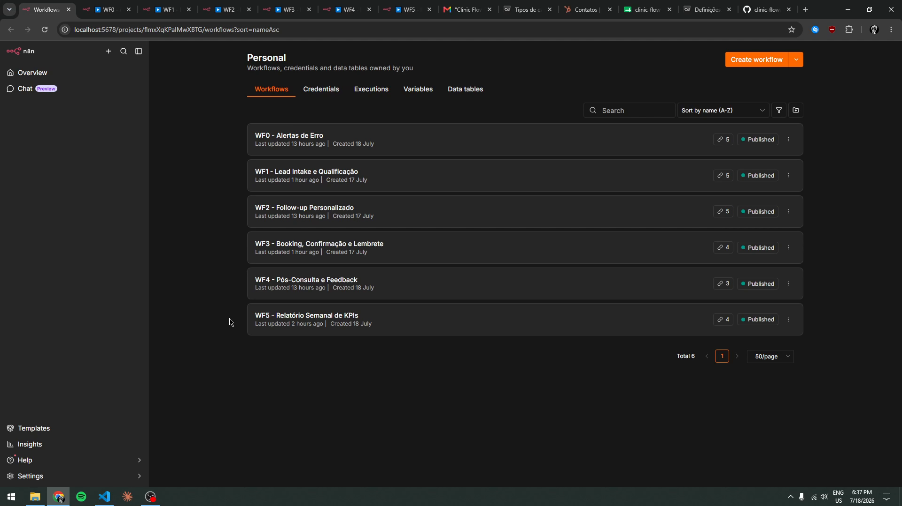
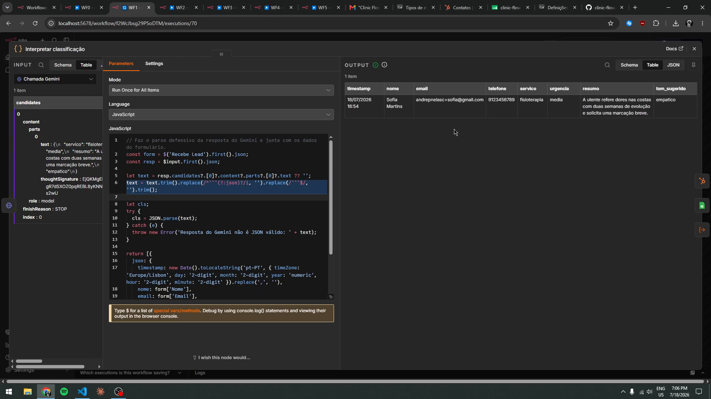
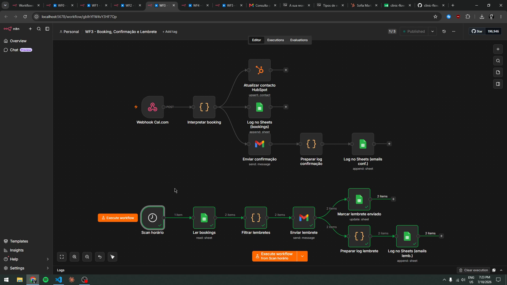
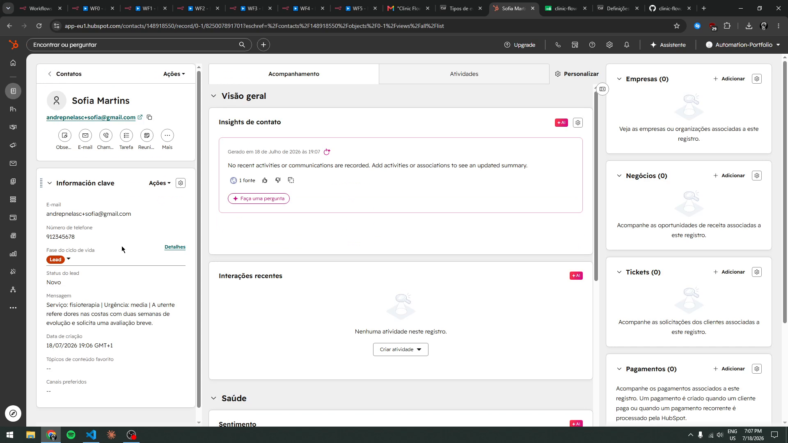
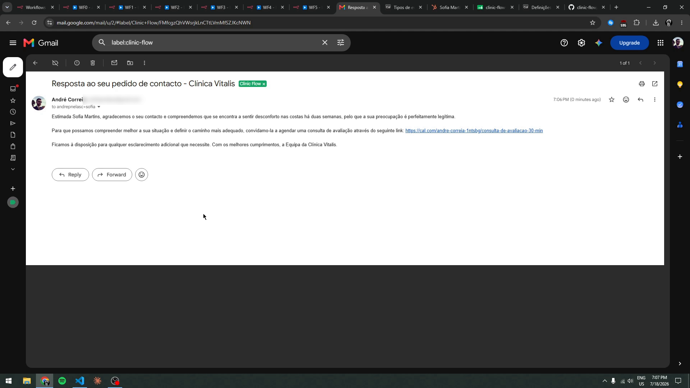

# Clinic Flow — Automação Lead→Consulta com n8n + IA

Clínicas perdem pacientes porque o follow-up de leads é lento e manual. O **Clinic Flow**
automatiza o fluxo completo: um lead preenche o formulário e, sem intervenção humana,
é qualificado por IA, registado no CRM, recebe um email personalizado com link de
marcação, confirmação e lembrete de consulta, follow-up pós-consulta — e a gerência
recebe um relatório semanal de KPIs redigido por IA.

> 🎥 **[Vídeo demo (7 min)](https://youtu.be/Q-YLWHCk1XI)** — o sistema completo a
> correr ao vivo: formulário → qualificação IA → email → marcação → lembrete →
> pós-consulta → relatório de KPIs.

## Estado do projeto

**Completo e testado end-to-end** (18 Jul 2026): os 5 workflows do fluxo + workflow
global de alertas de erro, todos validados com dados reais (formulário → qualificação →
email → marcação Cal.com → confirmação → lembrete → pós-consulta → relatório de KPIs).
O histórico de commits reflete o progresso real, sessão a sessão.

## Stack

| Componente | Ferramenta |
|---|---|
| Orquestração | [n8n](https://n8n.io) (self-hosted, Docker) |
| IA | Google Gemini Flash (classificação + redação) |
| CRM | HubSpot |
| Marcações | Cal.com (API + webhooks) |
| Email | Gmail API |
| Log / KPIs | Google Sheets |

## Arquitetura

Cinco workflows independentes que comunicam por webhooks e estado partilhado
(CRM/Sheets), mais um workflow global de tratamento de erros — ver
[docs/architecture.md](docs/architecture.md) para o diagrama completo e as decisões
de design.

1. **Lead Intake** — formulário → Gemini classifica serviço/urgência (JSON estrito) → HubSpot + log
2. **Follow-up** — Gemini redige email personalizado ao lead com link de marcação
3. **Booking** — webhook do Cal.com → confirmação + lembrete 24h antes (scan horário idempotente)
4. **Pós-consulta** — agradecimento e pedido de feedback no dia seguinte
5. **Relatório semanal** — KPIs calculados deterministicamente em n8n, resumo executivo redigido por Gemini
6. **Alertas de erro** — qualquer falha em produção dispara um email com workflow, nó, erro e link da execução

Decisões de arquitetura com intenção: lembretes por **scan idempotente com coluna de
estado** (nunca duplica, sobrevive a reinícios) em vez de timers pendurados; **KPIs
calculados em código** — o LLM só redige, nunca calcula; **parsing defensivo** de todas
as respostas do Gemini, com falha controlada e alerta.

## Em ação

_Os 6 workflows publicados na instância n8n:_

_WF1 — classificação do lead pelo Gemini: JSON estrito com serviço, urgência, resumo e tom sugerido:_

_WF3 — as duas cadeias: webhook do Cal.com → confirmação, e scan horário idempotente → lembrete (execução real, 2 consultas processadas):_

_Contacto criado e enriquecido automaticamente no HubSpot — lifecycle stage, telefone e classificação da IA:_

_Email de follow-up redigido pelo Gemini, personalizado ao pedido do lead, com link de marcação:_

## Prompt Engineering

Todos os prompts estão documentados em [prompts/](prompts/) — objetivo, input,
schema de output, guardrails (sem diagnósticos médicos, sem inventar preços/moradas)
e notas de design. Os workflows exportados estão em [workflows/](workflows/).

## Como correr

1. `docker compose up -d` (ver [docker-compose.yml](docker-compose.yml))
2. Seguir o guia de credenciais e túnel em [docs/setup.md](docs/setup.md)
3. Importar os JSONs de `workflows/` no n8n e associar as credenciais

---

_Projeto construído em 3 dias (16–18 Jul 2026) como demonstração prática de automação
de marketing com IA para clínicas. Dados de pacientes são fictícios; tudo corre em
free tier._
