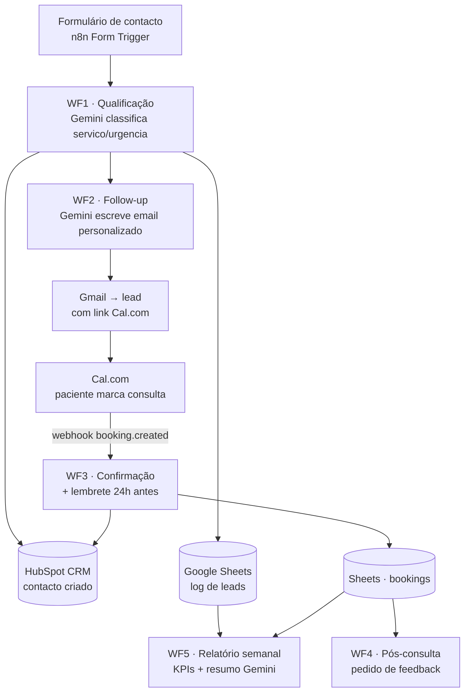

# Arquitetura — Clinic Flow

## Visão geral

Fluxo de automação lead→consulta para uma clínica fictícia ("Clínica Vitalis"),
orquestrado em n8n com IA (Gemini) nos pontos de decisão e redação.

## Workflows

| # | Workflow | Trigger | O que faz |
|---|---|---|---|
| WF1 | Lead Intake | Form Trigger | Valida, classifica com Gemini (JSON estrito), cria contacto no HubSpot, loga no Sheets, chama WF2 |
| WF2 | Follow-up | Execute Workflow Trigger | Gemini redige email personalizado; Gmail envia com link Cal.com |
| WF3 | Booking | Webhook (Cal.com) + Schedule | Confirmação imediata; lembrete quando faltam <24h (scan horário ao Sheets) |
| WF4 | Pós-consulta | Schedule (diário) | Consultas passadas sem follow-up → email de agradecimento + feedback |
| WF5 | Relatório | Schedule (semanal) | Agrega KPIs do Sheets em nós Code; Gemini redige resumo executivo |

## Decisões de arquitetura

- **Workflows independentes** que comunicam por webhooks e estado partilhado
  (CRM/Sheets) — cada um funciona e é testável isoladamente.
- **Lembretes por scan agendado** em vez de nós `Wait` de longa duração: sobrevive a
  restarts do n8n e é demonstrável ajustando a janela temporal.
- **LLM nunca calcula números** — os KPIs são calculados em nós Code/Aggregate;
  o Gemini apenas classifica e redige. Exatidão auditável.
- **JSON estrito nos outputs do LLM** com parse defensivo (strip de markdown fences)
  num nó Code a seguir a cada chamada Gemini.
- **Error Workflow global** do n8n: qualquer falha em produção envia email de alerta.
- **Minimização de dados**: só os campos necessários a cada prompt são enviados ao
  modelo (ex.: a classificação não recebe email/telefone do lead).
